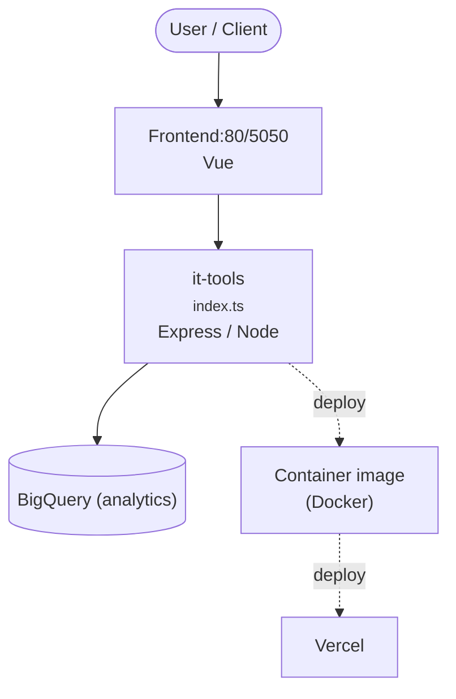

<picture>
    <source srcset="./.github/logo-dark.png" media="(prefers-color-scheme: light)">
    <source srcset="./.github/logo-white.png" media="(prefers-color-scheme: dark)">
    
</picture>

<p align="center">
Useful tools for developer and people working in IT. <a href="https://it-tools.tech">Try it!</a>
</p>

## Functionalities and roadmap

### Agent tools

The **Agent** category groups three tools for people wiring up LLM agents, MCP servers and provider connectors.
Everything runs client-side: requests go straight from your browser to the endpoint you point at, and any key you
paste is held in memory for the lifetime of the tab only. Nothing is persisted to local storage and nothing is sent
to it-tools.

| Tool | Path | What it does |
| --- | --- | --- |
| **MCP server tester** | `/mcp-server-tester` | Exercises a [Model Context Protocol](https://modelcontextprotocol.io) server over Streamable HTTP. Runs the `initialize` handshake, sends `notifications/initialized`, then lists tools, resources and prompts, and calls a tool with your own JSON arguments. Tracks the `Mcp-Session-Id` across calls, handles both plain JSON and `text/event-stream` responses, and shows status, latency and the raw JSON-RPC envelope for every call. |
| **LLM connector tester** | `/llm-connector-tester` | Sends a single probe request to Anthropic (Claude), Google (Gemini), or any OpenAI-compatible `/chat/completions` endpoint, to confirm a key, model id and base URL work end to end. Reports latency, token usage, stop reason and the raw response body. |
| **LLM recommender** | `/llm-recommender` | Ranks Claude and Gemini models against the workload you describe. Pick a task profile, what to optimise for, the context window and input types you need, and your monthly volume; you get a scored shortlist with the reasoning behind each pick and an estimated bill. |

Notes and caveats:

- **CORS.** Both testers call third-party endpoints directly from the browser, so the endpoint has to allow your
  origin. The Anthropic call sends `anthropic-dangerous-direct-browser-access: true` for you; for anything that
  refuses browser origins, point the base URL at your own gateway or proxy instead.
- **Keys.** API keys and bearer tokens are never written to disk or local storage, and are redacted in the result
  summary. They live only in the page's reactive state.
- **Pricing data.** The recommender's catalogue (model ids, context windows, prices, capability ratings) lives in
  `src/tools/llm-recommender/llm-recommender.constants.ts` and carries the date it was last reviewed. Provider
  pricing moves, so confirm against the provider before committing to a model. Cost estimates ignore prompt caching
  and batch discounts, which usually matter more than the gap between two neighbouring models.


Please check the [issues](https://github.com/CorentinTh/it-tools/issues) to see if some feature listed to be implemented.

You have an idea of a tool? Submit a [feature request](https://github.com/CorentinTh/it-tools/issues/new/choose)!

Useful tools for developer and people working in IT. [Have a look !].


## Self host

Self host solutions for your homelab

**From docker hub:**

```sh
docker run -d --name it-tools --restart unless-stopped -p 8080:80 abambah/it-tools:v3
```

**Other solutions:**

- [Cloudron](https://www.cloudron.io/store/tech.ittools.cloudron.html)
- [Tipi](https://www.runtipi.io/docs/apps-available)
- [Unraid](https://unraid.net/community/apps?q=it-tools)

## Contribute

### Recommended IDE Setup

[VSCode](https://code.visualstudio.com/) with the following extensions:

- [Volar](https://marketplace.visualstudio.com/items?itemName=Vue.volar) (and disable Vetur)
- [TypeScript Vue Plugin (Volar)](https://marketplace.visualstudio.com/items?itemName=Vue.vscode-typescript-vue-plugin).
- [ESLint](https://marketplace.visualstudio.com/items?itemName=dbaeumer.vscode-eslint)
- [i18n Ally](https://marketplace.visualstudio.com/items?itemName=lokalise.i18n-ally)

with the following settings:

```json
{
  "editor.formatOnSave": false,
  "editor.codeActionsOnSave": {
    "source.fixAll.eslint": true
  },
  "i18n-ally.localesPaths": ["locales", "src/tools/*/locales"],
  "i18n-ally.keystyle": "nested"
}
```

### Type Support for `.vue` Imports in TS

TypeScript cannot handle type information for `.vue` imports by default, so we replace the `tsc` CLI with `vue-tsc` for type checking. In editors, we need [TypeScript Vue Plugin (Volar)](https://marketplace.visualstudio.com/items?itemName=Vue.vscode-typescript-vue-plugin) to make the TypeScript language service aware of `.vue` types.

If the standalone TypeScript plugin doesn't feel fast enough to you, Volar has also implemented a [Take Over Mode](https://github.com/johnsoncodehk/volar/discussions/471#discussioncomment-1361669) that is more performant. You can enable it by the following steps:

1. Disable the built-in TypeScript Extension
   1. Run `Extensions: Show Built-in Extensions` from VSCode's command palette
   2. Find `TypeScript and JavaScript Language Features`, right click and select `Disable (Workspace)`
2. Reload the VSCode window by running `Developer: Reload Window` from the command palette.

### Project Setup

```sh
pnpm install
```

### Compile and Hot-Reload for Development

```sh
pnpm dev
```

### Type-Check, Compile and Minify for Production

```sh
pnpm build
```

### Run Unit Tests with [Vitest](https://vitest.dev/)

```sh
pnpm test
```

### Lint with [ESLint](https://eslint.org/)

```sh
pnpm lint
```

### Create a new tool

To create a new tool, there is a script that generate the boilerplate of the new tool, simply run:

```sh
pnpm run script:create:tool my-tool-name
```

It will create a directory in `src/tools` with the correct files, and a the import in `src/tools/index.ts`. You will just need to add the imported tool in the proper category and develop the tool.

Categories are declared in `toolsByCategory` in `src/tools/index.ts`, and their display names plus every tool title
and description are translated in `locales/*.yml` under `tools.<tool-path>` and `tools.categories.<category>`.

<!-- ARCH-DIAGRAM:START -->

## Architecture

> Auto-generated architecture diagram. See [`docs/context-map.md`](docs/context-map.md) for the full context map (core application, containers/cloud, and database connections).



<!-- ARCH-DIAGRAM:END -->
