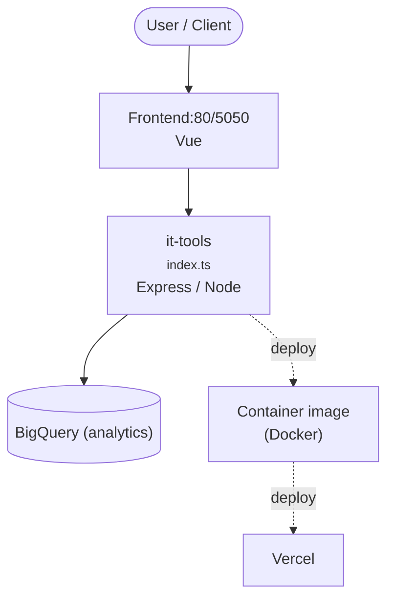

# Context Map — `it-tools`

> Auto-generated architecture & deployment context map. Summarizes the core application, container/cloud footprint, and database connections. Regenerate after significant structural changes.

**Repo:** `avnit/it-tools` · **Fork** · Public · Primary language: Vue · Default branch: `main` · Files: 499

**Description:** Collection of handy online tools for developers, with great UX.

## 1. Core application

Useful tools for developer and people working in IT. <a href="https://it-tools.tech">Try it!</a>

- **Frameworks / runtime:** Express / Node, Vue
- **Entry points:** `src/layouts/index.ts`, `src/main.ts`, `src/tools/ascii-text-drawer/index.ts`, `src/tools/base64-file-converter/index.ts`, `src/tools/base64-string-converter/index.ts`, `src/tools/basic-auth-generator/index.ts`
- **Listens on port(s):** 80, 5050

## 2. Containers & cloud applications

**Containers:**
- `.dockerignore`
- `Dockerfile`

**Cloud deploy / serverless manifests:**
- `netlify.toml`
- `vercel.json`

**Detected cloud platforms / services:** BigQuery, Vercel, Netlify

## 3. Database connections

**Datastores in use:** BigQuery (analytics)

**Referenced in:**
- `src/tools/sql-prettify/index.ts`

## 4. Architecture diagram

## 5. Security posture

- **Dependabot alerts (open):** 2 critical, 54 high, 35 medium, 7 low
- **Static scan findings:** 5 high, 4 medium

| Severity | Rule | File:Line |
|---|---|---|
| high | generic-secret-assign | `src/tools/password-strength-analyser/password-strength-analyser.service.test.ts:8` |
| high | generic-secret-assign | `src/tools/password-strength-analyser/password-strength-analyser.service.test.ts:11` |
| high | generic-secret-assign | `src/tools/password-strength-analyser/password-strength-analyser.service.test.ts:14` |
| high | generic-secret-assign | `src/tools/password-strength-analyser/password-strength-analyser.service.test.ts:24` |
| high | generic-secret-assign | `src/tools/password-strength-analyser/password-strength-analyser.service.test.ts:27` |
| medium | js-innerhtml | `src/composable/downloadBase64.ts:110` |
| medium | js-innerhtml | `src/tools/base64-file-converter/base64-file-converter.vue:48` |
| medium | jwt-hardcoded | `src/tools/jwt-parser/jwt-parser.vue:8` |

---
_Generated by repo context-mapping pass on 2026-08-13._